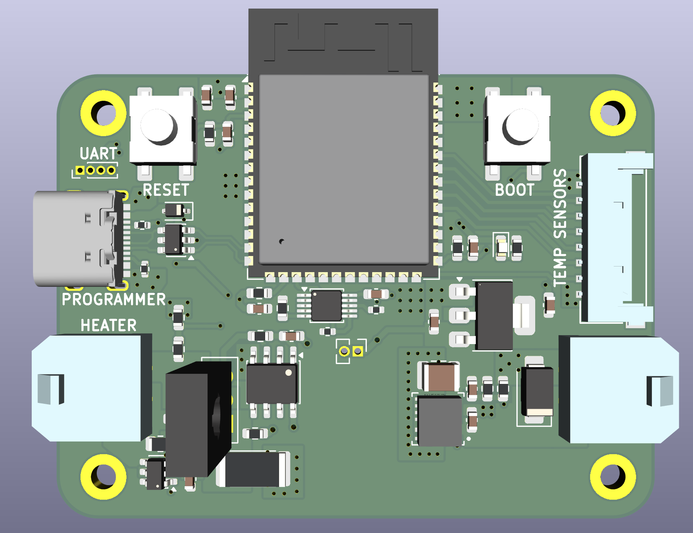
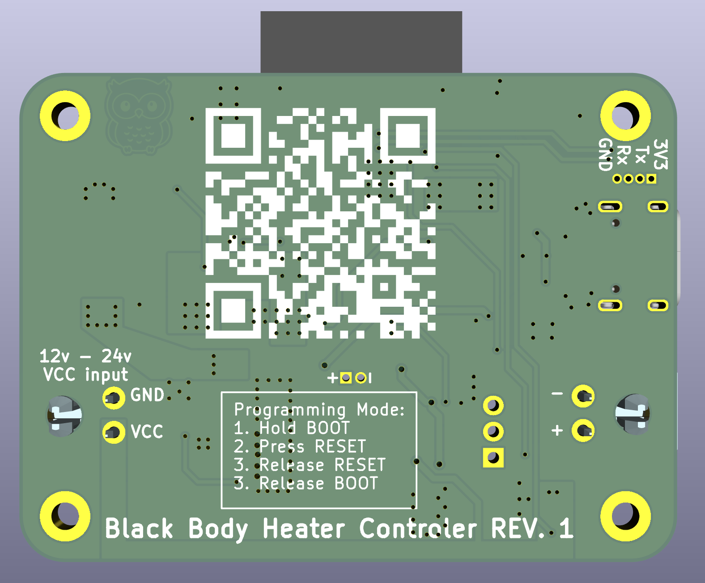
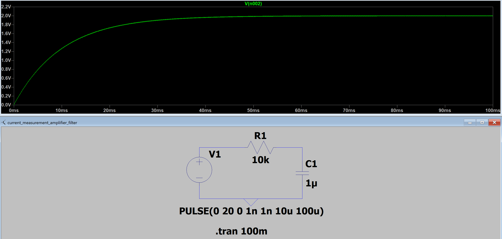
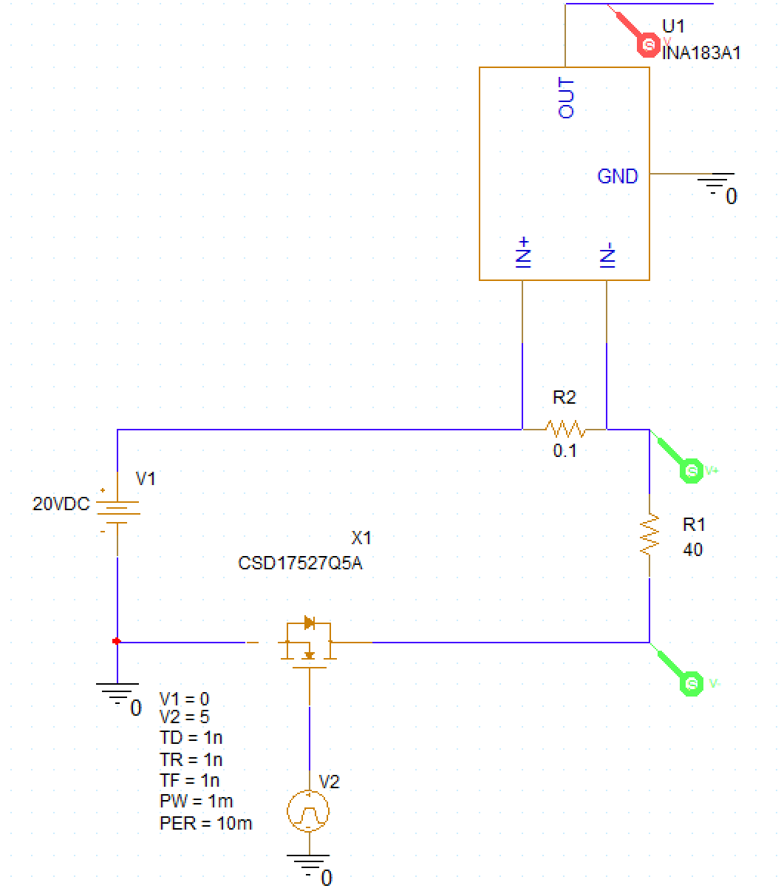
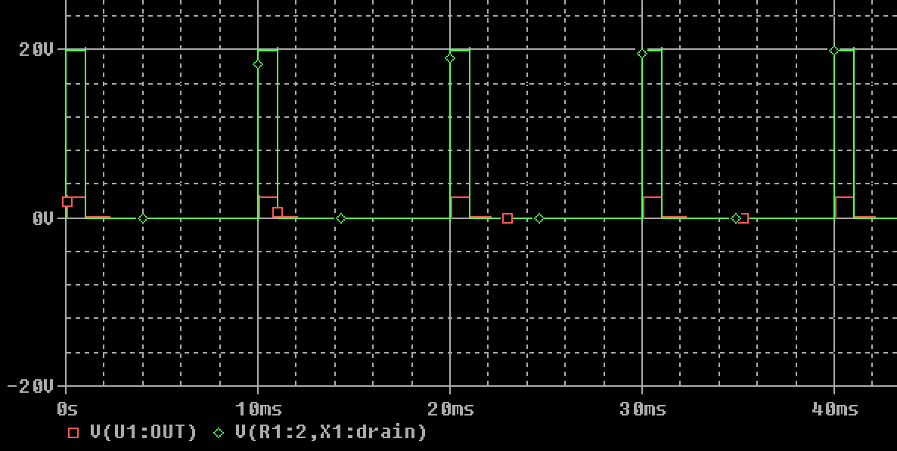

# Black Body Heater Control PCB

Two-layer circuit board carrying the ESP32 microcontroller and all heater control electronics: current source, voltage/current sensing, and power supply. See the [firmware README](../../Firmware/ESP32_heater/README.md) for how this board is driven, and the [root README](../../README.md) for overall project context.

Schematic: [Black_Body_Heater_Control_Schematic.pdf](../Black_Body_Heater_Control_Schematic.pdf)

## Microcontroller
An ESP32 was chosen for its high pin count and WiFi support, letting it self-host a web page for displaying readings and controlling the heater. It interfaces with the [temperature sensor board](../Black_Body_Temperature_Sensor_PCB/README.md) over SPI (3 CS lines for 3 temperature probes). The microcontroller is programmed over USB, with exposed pads for UART programming as a fallback. Board-to-board interfacing uses Molex connectors (504050-0891 for the SPI link) since they could be sampled for free.

## Heater Controller
The heater is 4x 10Ω resistors in series (40Ω total). A maximum output power of 10W requires a peak 12V at 0.3A, measured with a shunt resistor + amplifier (current) and a voltage divider (voltage), both read by the ESP32's internal 12-bit ADC. This gives a theoretical current step of 100µA (max 0.66A range) and a voltage step of 8mV (max 36V range).

The original design used an N-channel MOSFET with PWM to control heater voltage. Due to concerns about PWM noise interfering with the sensor board's measurements, this was replaced with an analog current source instead.

Output current vs. input voltage for the analog current source. A BJT and op-amp generate the current output, driven by a DAC that the microcontroller controls.

## Shunt Current Measurement
The shunt resistor is 100mΩ with a 50V/V amplifier gain, giving 2.5V output at 0.5A and 0.25V at 0.05A. A low-pass filter on the amplifier output is largely unnecessary now that PWM isn't used, but is kept (with an easy jumper to bypass it) in case it's needed. Simulated filtering of a 10% duty cycle, 10kHz PWM signal on 20V is shown below:

## Power Source
The board receives 12V from an external power supply. A buck converter steps this down to 5V at 2A, followed by an LDO to 3.3V for a clean, low-noise supply to the microcontroller and ADC. \
**Revision 1:** Changed buck converter to newer module as the rev 0 as it broke and fried both boards.

## Simulation
Heater and buck converter behavior were validated in PSpice before layout (see [Simulations/Heater_Controller_PCB](../../Simulations/Heater_Controller_PCB)):

