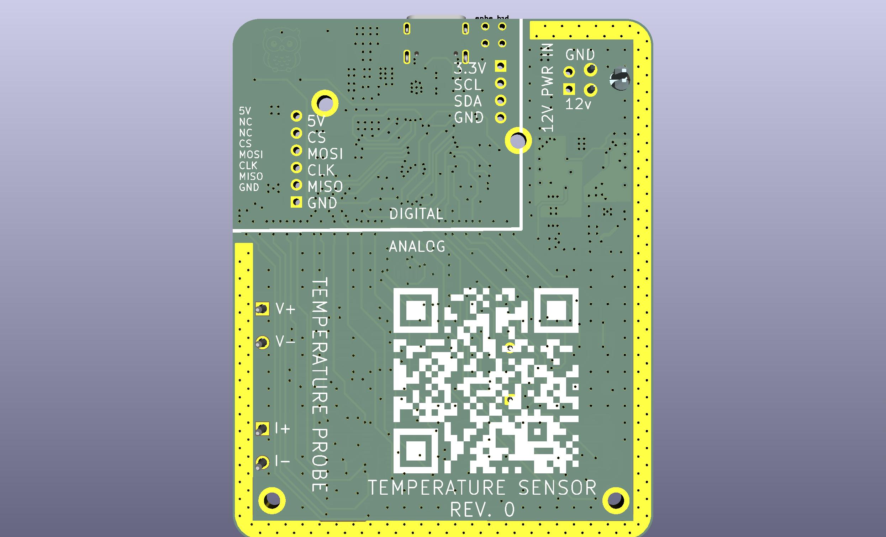
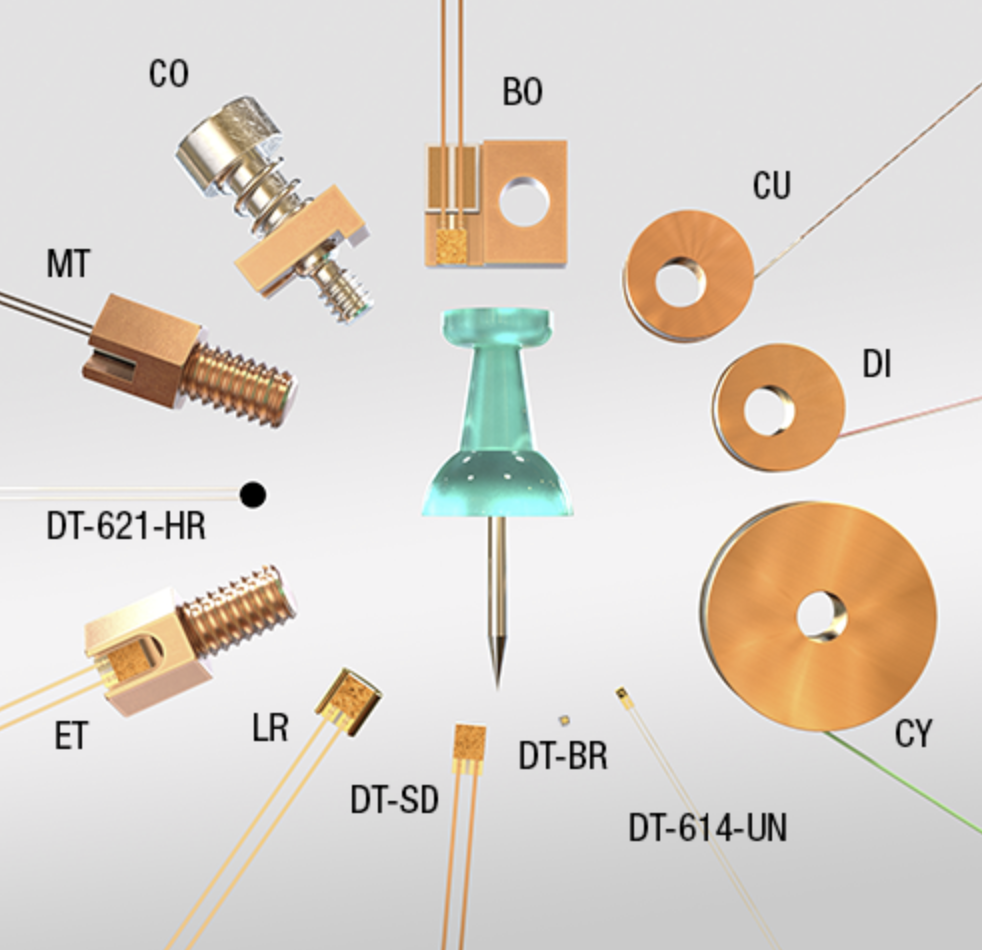
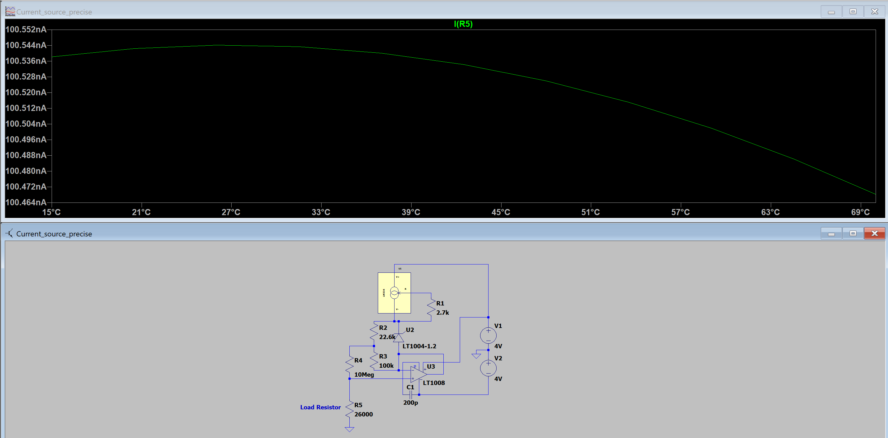
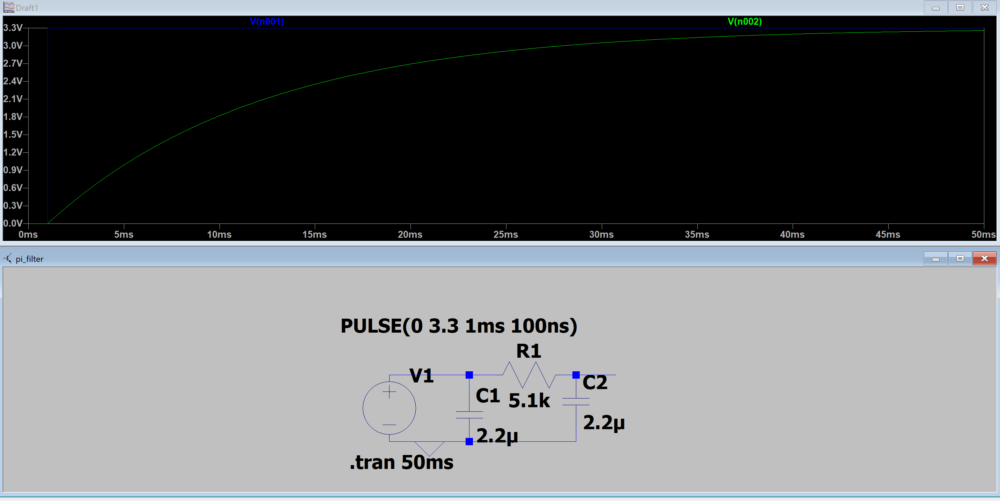

# Black Body Temperature Sensor PCB

Six-layer circuit board that reads temperature from Germanium RTD sensors and Silicon diode sensors. See the [firmware README](../../Firmware/stm32_black_body/README.md) for how this board is driven, and the [root README](../../README.md) for overall project context.




Schematic/board renders: [Black_Body_Temperature_Sensor_Schematic.pdf](../../Documentation/Black_Body_Temperature_Sensor_Schematic.pdf), [Black_Body_Temperature_Sensor_PCB.pdf](../../Documentation/Black_Body_Temperature_Sensor_PCB.pdf)

## Temperature Probe Readers
The board must support both Germanium sensors (LakeShore GR-300-AA) and Silicon diode sensors (LakeShore DT-670A1-CU), which are both 4-wire sensors: current is sourced over 2 wires (I+/I-) and voltage is read over the other 2 (V+/V-) so the voltage drop across the lead wires isn't included in the measurement.

Two LakeShore temperature probe readers were used as reference:


**Model 224:** Accurate to 0.3K with DC current from 100nA to 1mA. Ability to source both positive and negative current allows EMF voltages to be eliminated.


**Model 372:** Accurate to 0.05K with AC current as low as 10pA to eliminate self-heating at extremely low temperatures (power levels in attowatts, 10⁻¹⁸W). Significantly more complex to implement and unnecessary for our sensors, which don't go below 0.3K.

The Model 224 was used as the primary reference since this application won't go below 4K, and it supports almost the full range of the GR-300-AA and the full range of the DT-670A1-CU (down to 1.4K).

## DT-670A1-CU Sensor

Silicon diode temperature sensor, 1.4K to 420K range. Requires a constant excitation of 10µA ± 0.1%; the voltage across it ranges from 1.64V at 1.4K to 0.560V at 305K.

## GR-300-AA Sensor

Germanium temperature sensor, 0.3K to 100K range. Resistance varies logarithmically with temperature, from 35180Ω at 0.3K to 2.716Ω at 100K. Below 1K, excitation should be limited (LakeShore recommends 63µV; the Model 224 uses 3600µV at 0.3K to 900µV at 1K) since thermal mass is very small and self-heating matters more. Above 1K, excitation should stay under 10mV; the Model 224 sources 100nA to 1mA to keep the voltage under that limit.

## My Implementation
- Current excitation from 10nA to 1mA, DC, switchable direction.
- High-precision instrumentation amplifier for I+/I- sensor lead current measurement.
- Voltage measurement precise across 1mV to 10mV, since below 1K the signal can't go lower than ~0.9mV (10nA) and above 1K self-heating matters less.
- 24-bit ADC for both current and voltage; galvanic isolation between the digital and analog side is manually bypassed as it was causing issues and the same power supply is used for both digital and analog sides.
- Low-noise, high common-mode-rejection amplifiers to bring small signals up to reasonable voltage levels.

## Clean Voltage Supply
The board takes in a clean +12V, low-pass filtered. An LTC3260 splits the rail into +5V and -5V. The +5V rail is regulated to +3.3V with an LT3042EMSE, and the -5V rail similarly with an LT3094, for extra-clean supplies.

The LTC3260 could not be simulated (a common issue with its SPICE model), but the 3.3V regulator stages were simulated:


## Current Sources
Target outputs: 10nA, 100nA, 1µA, 10µA, 100µA, 1mA, split into two circuits (below 1µA and above/equal to 1µA).


Greater-than-1µA source, using the TI LM334 per its application note. Different current outputs are selected by switching resistors R1 & R3 with high-precision analog switches.


Less-than-1µA source, also using the LM334 but following an Analog Devices example schematic with an instrumentation op-amp to reach the 10nA range (confirmed by simulation). Analog switches again select the current level.

## Voltage Measurement
The Germanium sensors produce 0.5mV to 5mV at the given excitation currents. The signal is buffered by an OPA376 (10pA bias current), then fed to a differential instrumentation amplifier (AD8421ARZ, 200x gain), then into one of the 4 channels of a 24-bit ADC (ADS131M04). The ADC communication is isolated from the microcontroller to keep the analog and digital grounds separate.

## Current Measurement
Measured via the shunt method, using the same voltage-measurement chain to read the voltage drop across a 5Ω, 500Ω, or 33kΩ shunt (selected with analog switches).

## Switching Current Direction
The same analog switches (TMUX1112PWR, 3pA noise injection) reverse current direction between measurements to cancel out EMF voltages induced by dissimilar metals in the sensor leads.

## Digital Section
Built around the STM32G4. It has a 5V-tolerant SPI interface for talking to the [heater control board](../Black_Body_Heater_Control_PCB/README.md), and a USB 2.0 interface for programming and future use with a PC application. Either connection can supply power, with protection against both being connected simultaneously. An I2C breakout is provided for future expansion. All GPIOs driving the analog-section switches pass through a PI filter first to give a slow ramp-up and limit noise:



## Stackup
Six layers, chosen to simplify grounding, with ENIG surface finish:

```
Analog
Gnd
+3.3V
-3.3V
Gnd
Mixed signal
```

The two 3.3V layers also carry small digital 3.3V and GND traces to the analog switches. The bottom layer is primarily digital switch routing, with some small analog jumps.
