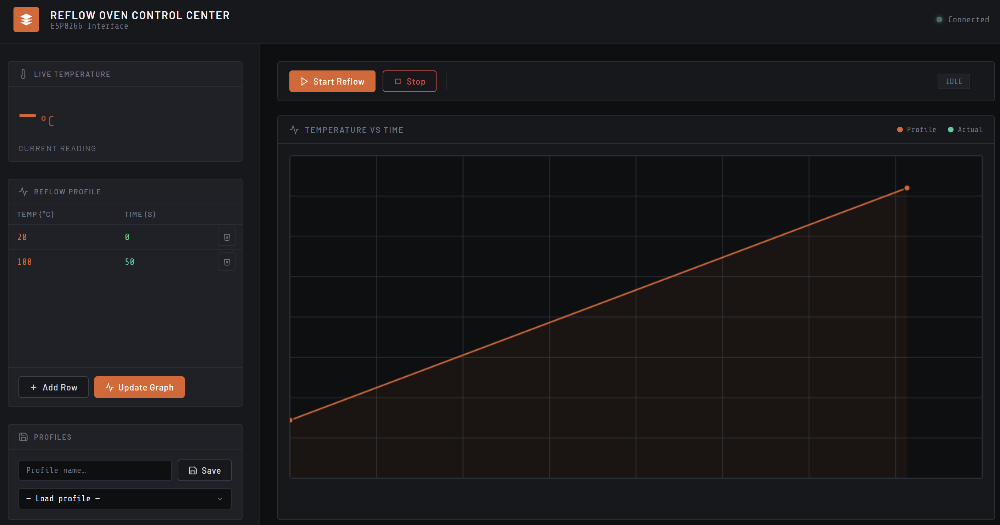
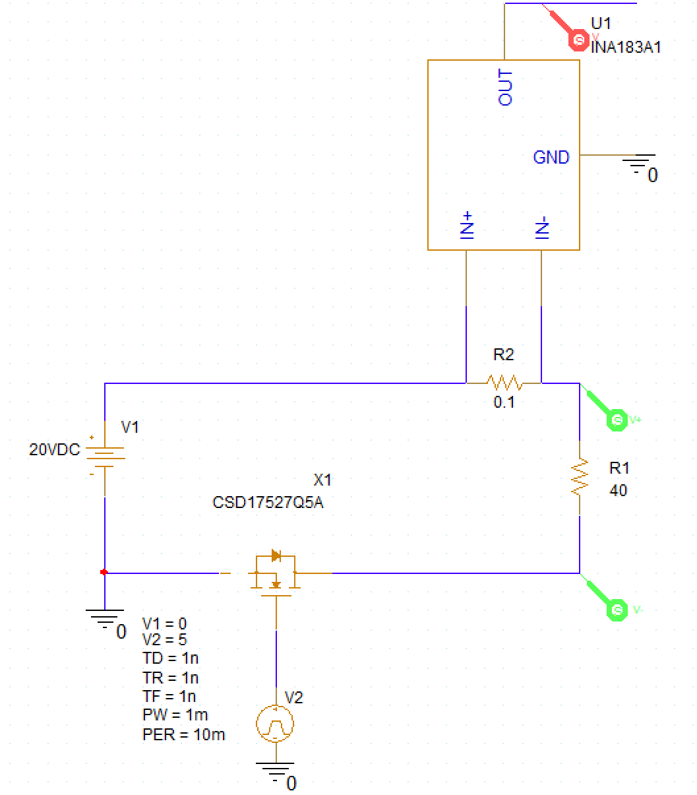
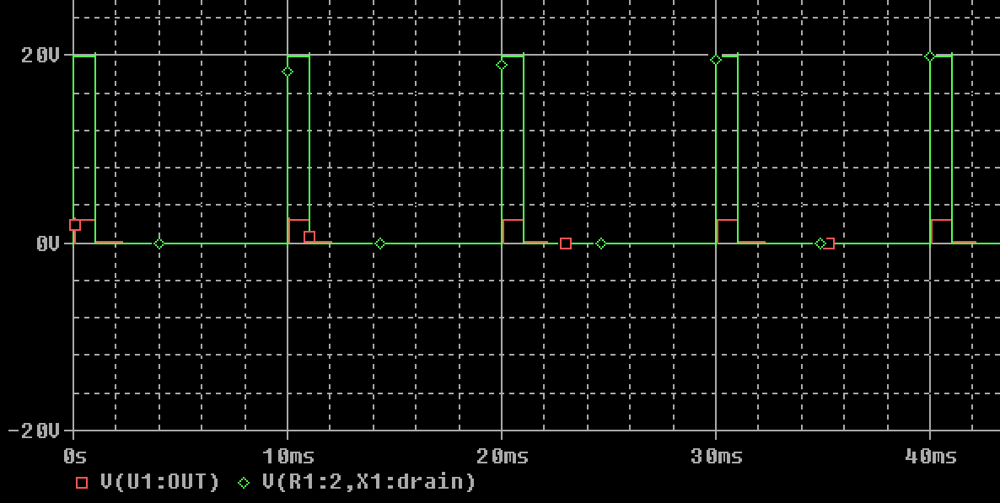

# Purpose
The goal for this project is to control a black body heater. The black body module will be mounted to the 4K stage of the cryostat and must be heated to >40K. This is accomplished by using 4x 10ohm heaters in series (40 ohm equivalent)with a maximum heat output of 10W (20V @ 5A).

# Design choices
Overall design includes 2 PCB's (printed circuit boards) - one includes the microcontroller and heater control (voltage and current sensing, voltage PWMing), the other reads the temperature from the Germanium RTD sensor or silicone diode temperature sensor. 

# ESP32 PCB Design Choices
Circuit board with ESP32 and heater PID control design choices.

### Microcontroller
ESP32 as it has lots of pins and supports wifi so it can self host a webpage to display the readings and control in an easy-to-use way. See below example of an microcontroller self hosted control website:


### Heater Controller
Using 4x 10ohms resistors in series gives a resistance of 40ohms total. To have a maximum output power of 10W, a peak power of 20V and 0.5A is requred. This will be mesured using a shunt resistor with amplifier and a voltage divider, both of which will be read by the ESP32's internal ADC, whose 12-bit resolution is likely sufficiently precise for the control required for this design. The max current measurement will be 0.66A with a theoretical step precision of 100uA. The max voltage measurement is 36V, giving a theoretical step of 8mV. An N-Channel mosfet rated for 60V and 3A is placed on the return side to allow PWM control to reduce the voltage. Since it is a resistive heater, a low PWM frequency could be used. The design was verified in Cadence's spice tool (it includes Texas Instruments shunt resistor measurement device) and the results of such can be seen below for a simulated 10% duty cycle on a 100hz PWM. 
<br>


<br>

The green pulse is the voltage the heater sees and the red is the output of the shunt resistor amplifier (current measurement).


### Power Source
The device will recieve 20V power from a power supply (either a lab adjustable power source or dedicated AC/DC power source). The ESP32 board has a buck converted to step it down to 5V at 2A. There will then be a simple LDO to convert to 3.3V to provide an even cleaner supply for the microcontroller for improved ADC fidelity.


# Temperature Sensor Design Choices
Design choices for PCB which reads temperature from Germanium RTD sensors and Silicon Diode sensors.

### Temperature probe readers
The temperature measurement board must support both germanium sensors (LakeShore GR-300-AA) and Silicon Diode sensors(LakeShore DT-670A1-CU) which are both 4 wire sensors where current is sent over 2 (I+/I-) and voltage is read over the other 2 (V+/V-) to not have voltage drop. 

There are two different temperature probe readers by LakeShore which could be used as reference:

**Model 224:** Accurate to 0.3K with DC current from 100nA to 1mA. Has ability to send both positive and negative current allows EMF voltages to be eliminated. 

**Model 372:** Accurate to 0.05K with AC current as low as 10pA to eliminate self heating at such low temperatures, giving power levels measured in attowatts (10^-18W). This is significantly more complex to implement and not useful for the sensors we have as they cannot go below 0.3k.

I will be using the Model 224 as this application won't go below 4K and it claims to be able to support almost the full range of the GR-300-AA sensor we have (reads to 0.35k, sensor able to go to 0.3k) and supports the full range of the DT-670A1-CU sensor (down to 1.4K).

### DT-670A1-CU Sensor
Silicon Diode temperature sensor which reads from 1.4K to 420K. It requires a constant excitation of 10uA ± 0.1% and the voltage is measured across it which ranges from 1.64V at 1.4K to 0.560V at 305K.

### GR-300-AA Sensor
Germanium temperature sensor which reads from 0.3K to 100K. Over that range the resistance varies from 35180Ω at 0.3K to 2.716Ω at 100K. This resistance changes in a logrithmic fashion with temperature. For temperatures less than 1K it recomends an excitation of 63uV to limit self heating interfering with measurement as thermal mass become very small at low temperatures, but the model 224 reader only does 3600uV at 0.3k to 900uV at 1K. For temperatures greater than 1K the excitation should be less than 10mV. The model 224 reader sends it between 100nA to 1mA to ensure the voltage range stays under 10mV.

## My plan
- Current excitation from 10nA to 1mA, DC, switchable direction.
- Current measurement of I+/I- sensor leads with high precision
- Voltage measurement with high precision in range of 1mV to 10mV as below 1K we cannot go lower than 0.9mV (10nA) and above 1K self heating matters less
- 24-bit adc to measure both current and voltage, add isolate to prevent gnd return paths
- Low noise, high common mode rejection for amplifiers to bring small signals to reasonable voltage levels 

**Summary:** 10nA to 1mA input, 1mV to 10mV voltage measurement.


### Clean voltage supply
Was unable to simulate LTC3260 which seems to be a common issue with it's spice model based on forums.
### Current source
Using application note from analog devices, confirmed using spice (for sub uA supply).
### Switching current direction
Switches with noise injection of 3pA.
### Current measurement


<br>

## Voltage measurment (V+/V-)
Reading voltages in the range of 20uV to 2V with high precision.

```
Small differential voltage -> differential instrumental amplifier -> isolated adc -> microcontroller
```

## Amplifiers
## 24-bit isolated adc
