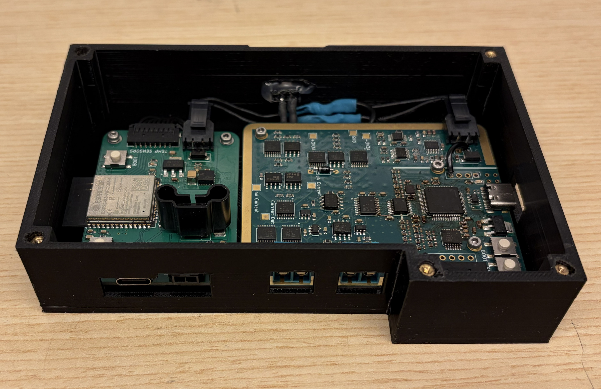

# Black Body Controller
[USER MANUAL](Documentation/README.md)

## Overview
This project controls and monitors a black body heater module mounted to the 4K stage of a cryostat. It is split into two custom PCBs: a heater control board built around an ESP32 (current source, voltage/current sensing, PID control, and a self-hosted web interface) and a temperature sensor board built around an STM32G4 for reading from a germanium temperature sensor for ranges from 0.3 to 100 kelvin (high-precision, low-noise excitation and readout for temperature probes). The two boards communicate over SPI, with the ESP32 acting as the master controller and network-facing interface.

## Project Goals
- Heat the black body module (4x 10Ω heaters in series, 40Ω equivalent) from the cryostat's 4K stage to temperatures above 80K, with closed-loop PID control.
- Accurately measure temperature across the cryogenic range using a Germanium RTD (LakeShore GR-300-AA).
- Provide low-noise, precisely switchable current excitation (10nA to 1mA) and high-resolution (24-bit) voltage/current measurement for sensor readout.
- Expose a self-hosted web interface (over WiFi) for live monitoring and control of both heating and measurement, with no external software required.

## Documentation
- [Heater Control PCB](Circuit%20Boards/Black_Body_Heater_Control_PCB/README.md) — heater current source, voltage/current sensing, and power supply design.
- [Temperature Sensor PCB](Circuit%20Boards/Black_Body_Temperature_Sensor_PCB/README.md) — sensor excitation, precision measurement, and isolation design.
- [ESP32 Firmware](Firmware/ESP32_heater/README.md) — heater PID control, SPI link to the sensor board, and the web interface.
- [STM32 Firmware](Firmware/stm32_black_body/README.md) — sensor excitation control, ADC readout, and the SPI link to the ESP32.
- [Device Usage Guide](Documentation/README.md) — how to power up, connect to, and operate the device.

## Repository Organization
**Circuit Boards:** KiCad source files and manufacturing/gerber files for both PCBs.

**Firmware:** ESP32 (PlatformIO) heater control firmware and STM32 (STM32CubeIDE) sensor readout firmware.

**Documentation:** Images, schematics, and the device usage guide.

**Simulations:** LTspice and PSpice simulations used to validate circuit designs before ordering.
