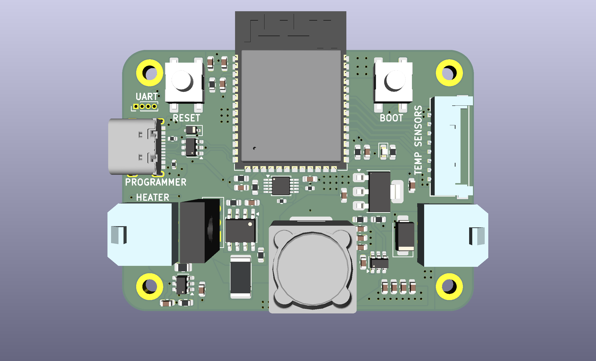
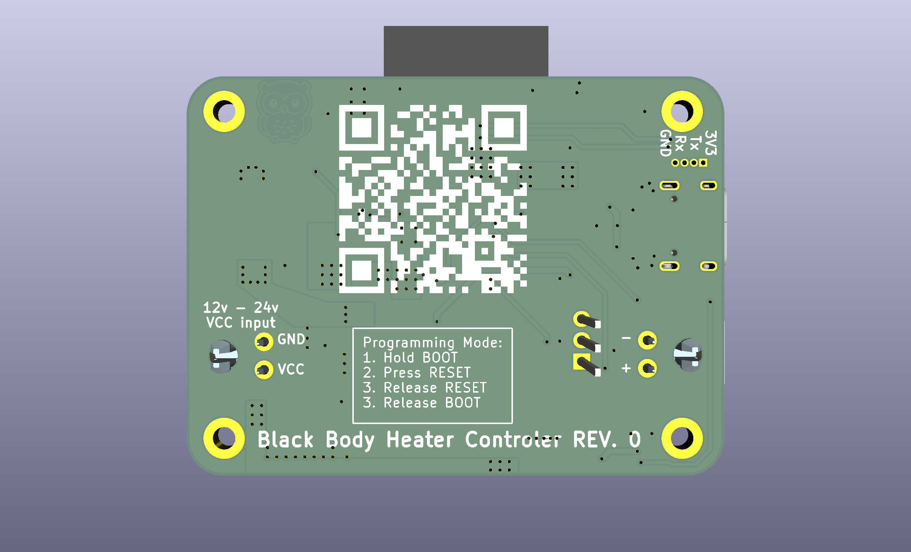
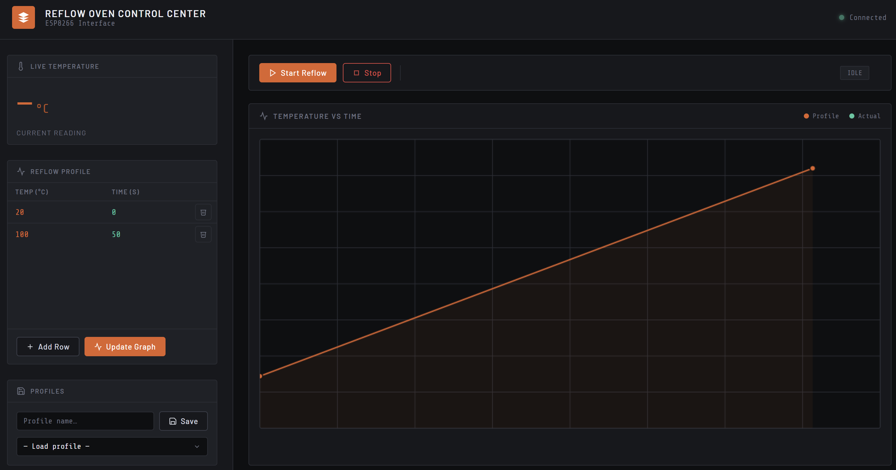
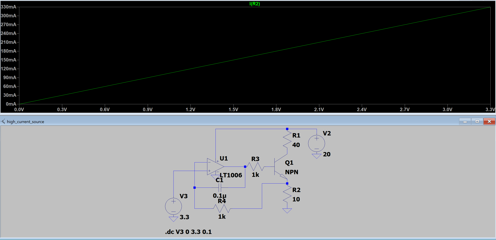
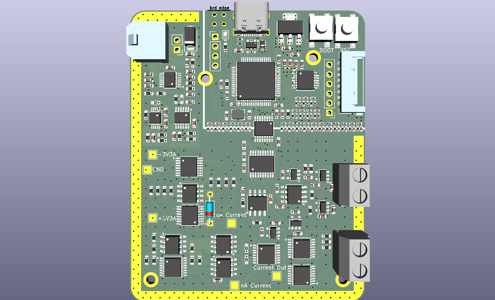
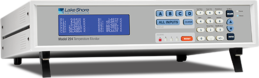
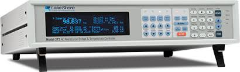
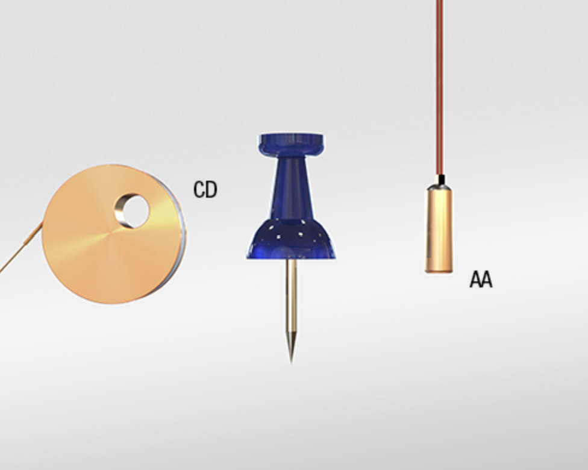
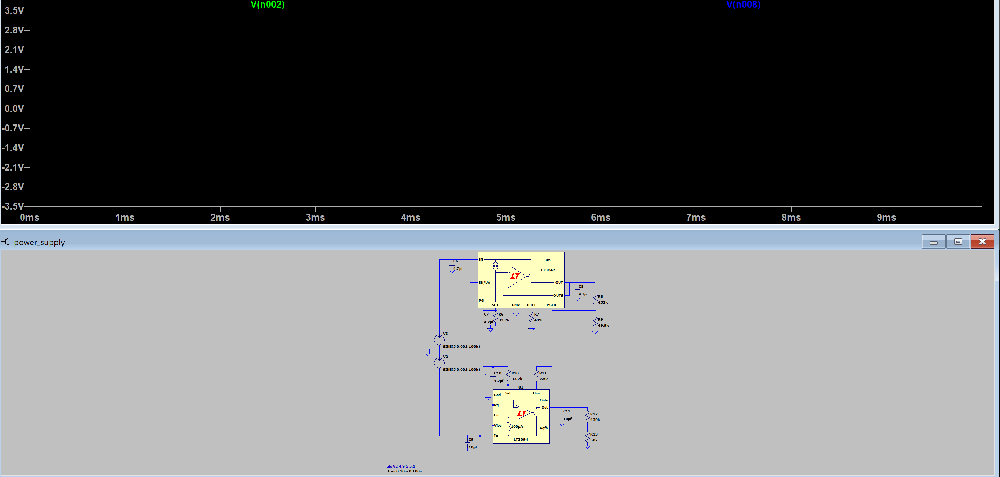
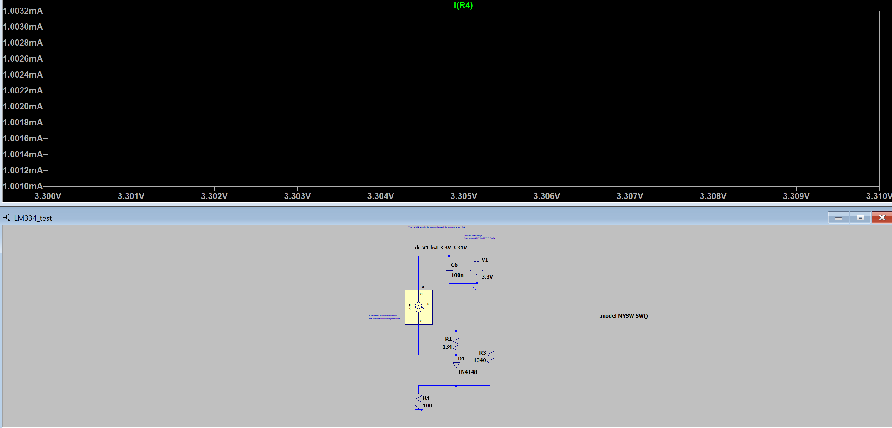

# Table of Contents
- [Purpose](#purpose)
- [Design Choices](#design-choices)
    - [ESP32 PCB Design Choices](#esp32-pcb-design-choices)
    - [Temperature Sensor Design Choices](#temperature-sensor-design-choices)
- [Repository Organization](#repository-organization)

# Purpose
The goal for this project is to control a black body heater. The black body module will be mounted to the 4K stage of a cryostat and must be heated to >80K. This is accomplished by using 4x 10ohm heaters in series (40 ohm equivalent) with a maximum heat output of 10W (20V @ 0.5A); part number TBH25P10R0JE-ND.

# Design Choices
Overall design includes 2 PCB's (printed circuit boards) - one includes the microcontroller and heater control (voltage and current sensing, heater current source, ESP32), the other reads the temperature from the Germanium RTD sensor or silicone diode temperature sensor. 

## ESP32 PCB Design Choices


Two layer circuit board with ESP32 and heater PID control design choices.

### Microcontroller
ESP32 as it has lots of pins and supports wifi so it can self host a webpage to display the readings and control in an easy-to-use way. See below example of an microcontroller self hosted control website:

The microcontroller will be programmed over usb with exposed pads for uart programming in case there is issues with USB. It interfaces with the temperature sensor board through an SPI connector with 3 cs pins for 3 temperature probes. This interface (part number: 504050-0891), along with all others (part number: 43650-0200), is done using molex connectors as they can be sampled for free.

### Heater Controller
Using 4x 10ohms resistors in series gives a resistance of 40ohms total. To have a maximum output power of 10W, a peak power of 20V and 0.5A is requred. This will be mesured using a shunt resistor with amplifier and a voltage divider, both of which will be read by the ESP32's internal ADC, whose 12-bit resolution is likely sufficiently precise for the control required for this design. The max current measurement will be 0.66A with a theoretical step precision of 100uA. The max voltage measurement is 36V, giving a theoretical step of 8mV. The original design used an N-channel mosfet to use PWM to control the voltage. Due to concerns of noise interfering with other measurements this was switched for an analog current supply as can be seen below.
<br>


This shows that the current output (y-axis)for a givien voltage input (x-axis). The design uses a BJT and opamp to generate the current output. The input voltage is generated by a DAC controlled by the microcontroller.
<br>


### Shunt Current Measurement
The shunt resistor will be 100mOhm and the aplifier gain will be 50V/V giving an output voltage of 2.5v at 0.5A and 0.25V at 0.05A. A low pass filter is placed on the amplifier output, but is likely not needed as the device no longer uses PWM, but has been kept as it can easily be jumped if it's an issue. A simulated example of the filtering can be seen below of a 10% duty cycle of 10khz pwm on 20V.


### Power Source
The device will recieve 20V power from a power supply (either a lab adjustable power source or dedicated AC/DC power source). The ESP32 board has a buck converted to step it down to 5V at 2A. There will then be a simple LDO to convert to 3.3V to provide an even cleaner supply for the microcontroller for improved ADC accuracy.


## Temperature Sensor Design Choices


Design choices for 6-layer PCB which reads temperature from Germanium RTD sensors and Silicon Diode sensors.

### Temperature probe readers
The temperature measurement board must support both germanium sensors (LakeShore GR-300-AA) and Silicon Diode sensors (LakeShore DT-670A1-CU) which are both 4 wire sensors where current is sent over 2 (I+/I-) and voltage is read over the other 2 (V+/V-) to not read the voltage drop over the wires due to resistance. 

There are two different temperature probe readers by LakeShore which could be used as reference:

<br>


**Model 224:** Accurate to 0.3K with DC current from 100nA to 1mA. Has ability to send both positive and negative current allows EMF voltages to be eliminated. 

<br>


**Model 372:** Accurate to 0.05K with AC current as low as 10pA to eliminate self heating at such low temperatures, giving power levels measured in attowatts (10^-18W). This is significantly more complex to implement and not useful for the sensors we have as they cannot go below 0.3k.

I will be using the Model 224 as a reference as this application won't go below 4K and it claims to be able to support almost the full range of the GR-300-AA sensor we have and supports the full range of the DT-670A1-CU sensor (down to 1.4K).

### DT-670A1-CU Sensor

Silicon Diode temperature sensor which reads from 1.4K to 420K. It requires a constant excitation of 10uA ± 0.1% and the voltage is measured across it which ranges from 1.64V at 1.4K to 0.560V at 305K.

### GR-300-AA Sensor

Germanium temperature sensor which reads from 0.3K to 100K. Over that range the resistance varies from 35180Ω at 0.3K to 2.716Ω at 100K. This resistance changes in a logrithmic fashion with temperature. For temperatures less than 1K it recomends an excitation of 63uV to limit self heating interfering with measurement as thermal mass become very small at low temperatures, but the model 224 reader only does 3600uV at 0.3k to 900uV at 1K. For temperatures greater than 1K the excitation should be less than 10mV. The model 224 reader sends it between 100nA to 1mA to ensure the voltage range stays under 10mV.

### My Implementation
- Current excitation from 10nA to 1mA, DC, switchable direction.
- Current measurement of I+/I- sensor leads with high precision using instrumentational amplifier
- Voltage measurement with high precision in range of 1mV to 10mV as below 1K we cannot go lower than 0.9mV (10nA) and above 1K self heating matters less
- 24-bit adc to measure both current and voltage; isolation to digital side to have fully seperate gnd & pwr for minimum noise
- Low noise, high common mode rejection for amplifiers to bring small signals to reasonable voltage levels 


### Clean voltage supply
The device takes in a clean +12v which is filter using a low pass. The LTC3260 is then used to split the rail into a +5v and -5v rail. The +5v rail is converted to +3.3V using the LT3042EMSE for even cleaner voltage, and same for the negative rail with the lt3094. 
I was unable to simulate LTC3260 which seems to be a common issue with it's spice model, but a simulation of the 3.3V regulators can be seen below.


### Current sources
The target for the current source was to have the ability to output 10nA, 100nA, 1uA, 10uA, 100uA, 1mA. This was split into two seperate circuits for below 1uA and above (or equal to) 1uA. 


The above simulation shows the greater than 1uA source. This utilises the TI LM334 and follows the application note for current source operation. To acheive the different current outputs the resistors R1 & R3 are switched using high precision analog switches.


The above simulation shows the less than 1uA source. This again uses the LM334, but following an analog devices example schematic in conjunction with an instrumental op-amp gives currents in the 10nA range, which was confirmed by simulations. Again, analog switches are used to change current.

### Voltage measurement
The germanium sensors with the given current will produces voltages in the range of 0.5mV to 5mV. The signal is buffered by OPA376 which have extremely low bias current of 10pA. This is then fed to the differential instrumentational amplifier AD8421ARZ which has a gain of 200x. This then feeds one of the 4 channels of the 24-bit adc ADS131M04. The adc communication is isolated from the microcontroller to maintain seperate gnd's between analog and digital.

### Current measurement
Current is measured using the shunt method. The same system as for measuring voltage is used to measure voltage drop over a 5, 500 or 33k resistor (changed using analog switches).

### Switching current direction
The same switches as previously used (TMUX1112PWR) with noise injection of 3pA are used to change the direction of current flow between each measurement to cancel out induced emf voltages between the temperature sensors dissimilar metals.

### Digital Section
The Digital section is focused arround the STM32G4 chip. It has an SPI interface which is 5v compatible for reading data from another microcontroller. It also has a USB 2.0 interface for programming and future use with a computer application for receiving data. Either device can provide power with protection against simultaneous power connections. An I2C breakout is provided for potential future expansion. All gpio's which go into the analog section to control the switches first pass through a PI filter to give a slow ramp up to limit noise as seen in the simulation below.


### Stackup
This circuit board uses 6-layers to simplfiy grounding and has an gold enig surface coating. The stackup is 

```
Analog
Gnd
+3.3V
-3.3V
Gnd
Mixed signal
```
The two 3.3V layers also carry small traces for digital 3.3v and gnd to the analog switches. The bottom layer is primarily digital switch routing, but has some small analog jumps.

# Repository Organization
**Circuit boards:** Kicad source files and manufacturing gerber files for both circuit boards.

**Firmware:** Contains temperature probe stm32 code and heater pcb platformio code.

**Images:** Images of circuit boards and simulations for use in README file.

**Simulations:** LTspice and Pspice simulations of circuits to test performance of designs before ordering.
